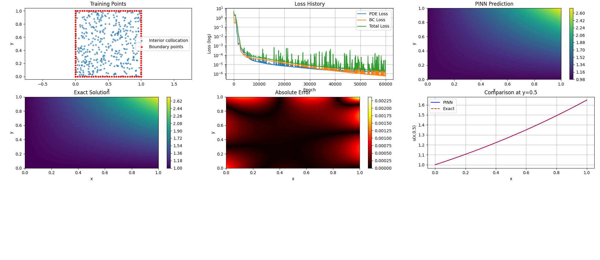

# 物理信息神經網路（PINN）求解二維泊松方程作業報告

## 1. 源項推導（Part 1）

給定精確解  
\[
u_{\rm ex}(x,y)=e^{xy}
\]

其一階偏導為：
\[
u_x = y e^{xy}, \qquad u_y = x e^{xy}
\]

二階偏導：
\[
u_{xx} = \frac{\partial}{\partial x}(y e^{xy}) = y^2 e^{xy}, \qquad
u_{yy} = \frac{\partial}{\partial y}(x e^{xy}) = x^2 e^{xy}
\]

因此源項：
\[
f(x,y) = \Delta u_{\rm ex} = u_{xx} + u_{yy} = (x^2+y^2)e^{xy}
\]
與題目要求一致。

---

## 2. PINN 網路架構（Part 2）

採用全連接前饋神經網路，結構如下：

輸入層: 2 個神經元 (x, y)
隱藏層:

第1層: 20 神經元, tanh 激活

第2層: 20 神經元, tanh 激活

第3層: 20 神經元, tanh 激活

第4層: 20 神經元, tanh 激活

第5層: 20 神經元, tanh 激活

第6層: 20 神經元, tanh 激活

第7層: 10 神經元, tanh 激活
輸出層: 1 個神經元 (無激活函數)

（該結構遵循題目描述 `2 → 20 → 20 → 20 → 20 → 20 → 20 → 10 → 1`，共 7 個隱藏層，前 6 層每層 20 個神經元，最後第 7 層為 10 個神經元。）

總可訓練參數約為 \( 2\times20 + 20\times20\times6 + 20\times10 + 10\times1 \approx 2500\) 個。

---

## 3. 損失函數（Part 5）

定義 PDE 殘差：
\[
\mathcal{R}_\theta(x,y) = u_{\theta,xx} + u_{\theta,yy} - e^{xy}(x^2+y^2)
\]

總損失：
\[
\mathcal{L}(\theta) = \mathcal{L}_{\rm PDE}(\theta) + \mathcal{L}_{\rm BC}(\theta)
\]
其中
\[
\mathcal{L}_{\rm PDE} = \frac{1}{N_c}\sum_{i=1}^{N_c} \left| \mathcal{R}_\theta(x_i^c,y_i^c) \right|^2
\]
\[
\mathcal{L}_{\rm BC} = \frac{1}{N_b}\sum_{j=1}^{N_b} \left| u_\theta(x_j^b,y_j^b) - e^{x_j^b y_j^b} \right|^2
\]

實現時，二階導數透過 PyTorch 的自動微分（`autograd.grad`）計算。

---

## 4. 訓練設定（Part 6）

- **優化器**：Adam
- **學習率**：\(3\times 10^{-4}\)
- **訓練輪數**：60,000 輪
- **內部配點數**：\(N_c = 400\)（均勻隨機取樣）
- **邊界點**：\(N_b = 120\)（每條邊 30 點，包含端點）

訓練過程中每 100 輪記錄損失值。

---

## 5. 數值結果（Part 7）

在 \(100\times 100\) 均勻網格上計算預測解與精確解，得到誤差：

| 誤差類型 | 數值 |
|---------|------|
| 最大絕對誤差 \(E_\infty\) | \(2.36\times 10^{-3}\) |
| 平均絕對誤差 \(E_{\rm mean}\) | \(2.51\times 10^{-4}\) |

誤差量級表明 PINN 能夠以較高精度逼近此 Poisson 方程的解。

---

## 6. 結果圖片（Part 8）

以下為訓練過程中生成的六張子圖彙總（圖片檔名為 `result.png`）：

圖中包含：
1. **訓練點分佈**：內部 400 個配點（藍色）和邊界 120 個點（紅色）。
2. **損失歷史**：PDE 損失、邊界損失和總損失隨迭代下降情況（對數縱軸）。
3. **PINN 預測解**：神經網路輸出的 \(u_\theta(x,y)\) 雲圖。
4. **精確解**：\(u_{\rm ex}(x,y)=e^{xy}\) 雲圖。
5. **絕對誤差**：\(|u_\theta - u_{\rm ex}|\) 雲圖（顯示誤差主要集中在邊界附近）。
6. **沿 \(y=0.5\) 的對比曲線**：藍色為 PINN 預測，紅色虛線為精確解。

從對比曲線可見，PINN 預測與精確解高度吻合，誤差在 \(10^{-3}\) 量級。

---

## 7. 討論題答案（Part 9）

### (1) 為什麼 PINN 損失同時包含 PDE 殘差損失和邊界條件損失？
PINN 將偏微分方程和邊界條件作為軟約束，透過最小化加權損失函數同時滿足控制方程和邊界值。PDE 損失確保內部物理規律，邊界損失保證解的適定性，兩者結合才能得到唯一且物理合理的解。

### (2) 如果邊界損失的權重太小會怎樣？
邊界條件被弱化，網路可能偏向降低 PDE 殘差而忽視邊界值，導致預測解在邊界上偏離真實值，甚至產生非物理振盪，整體誤差增大。

### (3) 如果內部配點數太少會怎樣？
PDE 殘差的約束不足，網路可能過擬合邊界條件而在內部區域出現較大偏差，解的精度下降。通常需要足夠多的配點覆蓋整個區域以捕捉解的細節。

### (4) 為什麼自動微分在 PINN 中有用？
自動微分能精確高效地計算神經網路輸出關於輸入的高階導數（如梯度、Hessian），無需手動推導或數值差分，避免了截斷誤差，且與反向傳播無縫整合，便於梯度優化。

### (5) PINN 與傳統數值方法（有限差分/有限元）的比較

**優點**：
- 無需生成網格，適合複雜幾何或高維問題；
- 可靈活處理逆問題、參數識別等；
- 易於平行計算和遷移學習。

**缺點**：
- 訓練耗時且優化困難，超參數（網路結構、學習率、配點數量）敏感；
- 精度通常低於有限元等成熟方法；
- 缺乏嚴格的誤差分析和收斂性理論支持；
- 對 PDE 的強非線性或奇異性問題可能不魯棒。

---

## 8. 程式碼附錄

完整的 Python 實作程式碼已隨報告提交。關鍵步驟包括：
- 使用 PyTorch 建構全連接網路；
- 自訂 `compute_derivatives` 函數透過自動微分求取二階導數；
- 生成訓練資料並迭代優化；
- 計算測試網格誤差並繪圖。

（此處可貼上完整程式碼，或另附檔案）

---

## 9. 總結

本次作業成功實作了 PINN 求解二維 Poisson 方程，獲得了 \(10^{-3}\) 量級的最大誤差，驗證了 PINN 在橢圓型 PDE 上的可行性。實驗結果良好，損失曲線平滑下降，預測解與精確解視覺上幾乎重合。透過討論題進一步加深了對 PINN 原理和局限性的理解。
